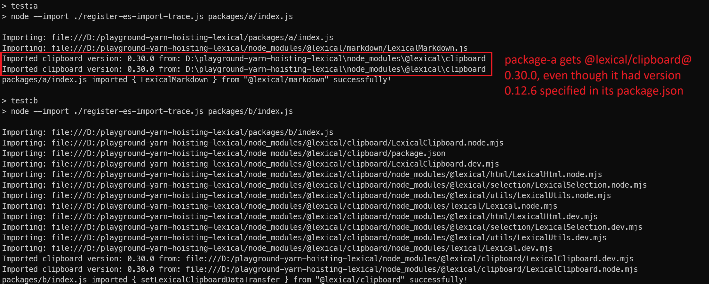
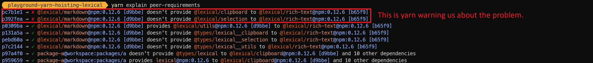

# playground-yarn-hoisting-lexical

This is a playground to permit experimentation with yarn4's hoisting behavior when using `lexical`-related dependencies in a monorepo.

## Setup

This is a simple monorepo with two packages, `a` and `b`. We want each to use their own specified versions of lexical-related packages. However, yarn4 hoisting mixes things up.

`a` is trying to use older versions of lexical packages, and has this dependency chain (simplified):

```jsonc
{
  "name": "package-a",
  "dependencies": {
    // This is the only "direct" dependency of package-a that is actually used in its code:
    "@lexical/markdown": "^0.12.6",
    // This is package-a's attempt at specifying an "indirect" peer dependency:
    "@lexical/clipboard": "0.12.6",
    // ...other omitted
  }
}
```

```jsonc
{
  "name": "@lexical/markdown",
  "version": "0.12.6",
  "dependencies": {
    "@lexical/rich-text": "0.12.6",
    // ...others omitted
    // NOTE: no direct dependency on @lexical/clipboard here
  }
  // NOTE: no peerDependency to @lexical/clipboard here
}
```

```jsonc
{
  "name": "@lexical/rich-text",
  "version": "0.12.6",
  "peerDependencies": {
    "@lexical/clipboard": "0.12.6",
    // ...others omitted
  },
}
```

`b` is trying to use new versions of lexical packages, and has this dependency chain:

```jsonc
{
  "name": "package-b",
  "dependencies": {
    "@lexical/clipboard": "^0.30.0"
  }
}
```

## Results

1. Install yarn globally with `npm install -g yarn`
2. Run `yarn retest:windows:all`. This will...
    - Clean the workspace by deleting all `node_modules` and `yarn.lock`
    - Reinstall dependencies with `yarn install`
    - Run a script that will look for all installed versions of `@lexical/clipboard`, and add a console.log statement to the end of them that will enable you to see which ones get imported.
    - Run the actual code packages A and B, which simply imports a random thing from their direct dependencies and logs it. This will output console statements showing what actually got imported.

You can see that package A ends up using `@lexical/clipboard` version `0.30.0`, even though it was expecting `0.12.6`:



Running `yarn explain peer-requirements` shows a warning that seems related to the problem:

